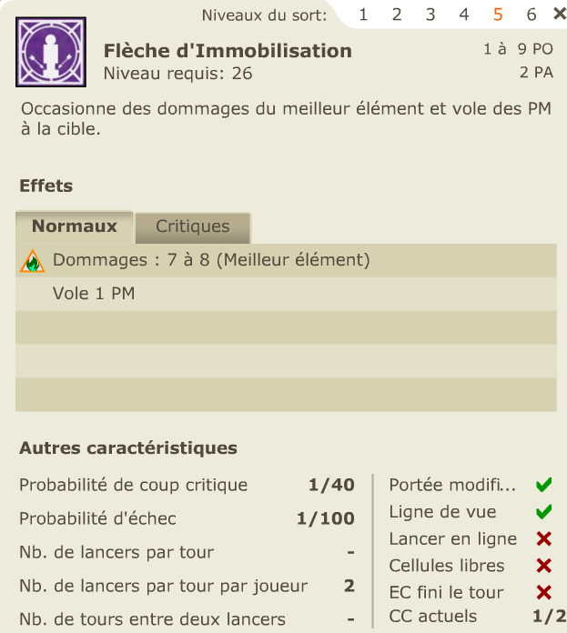

# ✴️ Mystery Ton Magicae v1

Dans l’univers d’**Asuma**, certaines boîtes mystérieuses circulent parmi les aventuriers les plus curieux… Ce sont les **Mystery Ton Magicae** !

📦 **Qu’est-ce que c’est ?**\
Il s’agit de coffres enchantés renfermant d’étranges potions alchimiques. \
Ces breuvages uniques sont capables d’altérer la puissance de vos sorts et de les rendre encore plus redoutables en combat.

<figure><figcaption></figcaption></figure>

| Classe      | Ton Magicae          | Effet du Ton Magicae                                                                                        |
| ----------- | -------------------- | ----------------------------------------------------------------------------------------------------------- |
| Féca 🛡️    | Aveuglement          | **Désactive la ligne de vue** du sort **Aveuglement**                                                       |
| Osamodas 🐗 | Fouet                | **Augmente de 1** le **nombre de lancer maxima**l par **tour** du sort **Fouet**                            |
| Enirispa 💓 | Mot interdit         | Le sort **Mot Interdit** passe désormais en **vol de vie** basé sur **l’élément le plus élevé du lanceur**. |
| Enutrof 💰  | Pelle Massacrante    | **Augmente de 1** le **nombre de lancer maximal** par cible du sort **Pelle Massacrante**                   |
| Iop ⚔️      | Tempête de Puissance | Augmente les dégâts de base du sort **Tempête de Puissance** de **156**                                     |
| Sram 👿     | Attaque Mortelle     | Donne **+15** **aux coups critiques** sur le sort **Attaque Mortelle**                                      |
| Crâ 🏹      | Flèche d'Expiation   | Réduit de **1** le **délai de relance** du sort **Flèche d'Expiation**                                      |
| Xélor ⌛     | Horloge              | **Désactive le lancer en lign**e du sort **Horloge**                                                        |
| Ecaflip 😾  | Topkaj               | Inflige des **dégâts** en **vol de vie Feu**                                                                |
| Sadida 🌳   | Feu de Brouse        | Inflige des **dégâts basés** sur **l'élément le plus élévé du lanceur**                                     |
| Sacrieur 🩸 | Dissolution          | **Augmente** la **portée** du sort **Dissolution** de **5**                                                 |
| Pandawa 🍻  | Vulnérabilité        | **Augmente** de **1** le **nombre de lancer maximal** par cible du sort **Vulnérabilité**                   |
